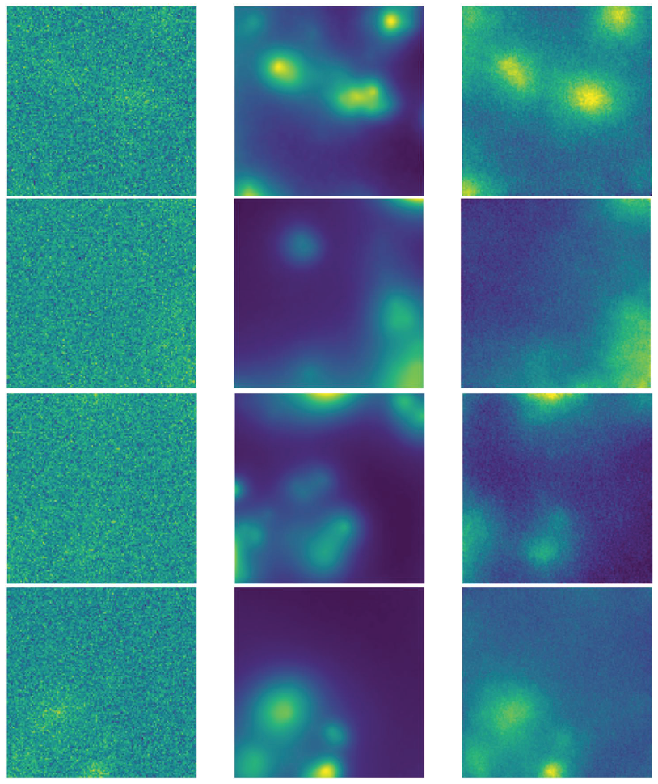

# Diffusion models for denoising astronomical images

This repository contains the code of the main project of my Honor Program in Data Science (a.y. 2023/24) I collaborated with Professor [Pierpaolo Brutti](https://phd.uniroma1.it/web/PIERPAOLO-BRUTTI_nC1622_IT.aspx) and PhD student [Riccardo Ceccaroni](https://github.com/riccardoc95) to explore the application of Diffusion Models for Denoising Astronomical Images. This research project was in collaboration with [Astronomical Observatory of Rome (National Institute of Astrophysics)](https://www.oa-roma.inaf.it/) and involved the use advanced generative models to address the problem of noise in astronomical data, which is critical for a number of tasks such as image analysis and reconstruction.

## Table of Contents

1. [Project Overview](#diffusion-models-for-denoising-astronomical-images)  
2. [Brief Description](#brief-description)  
3. [Disclaimer](#disclaimer)  
4. [Prerequisites](#prerequisites)  
   - [Setting Up the Environment](#setting-up-the-environment)
   - [Clone the Repository](#1-clone-the-repository)
   - [Install Anaconda Project](#2-install-anaconda-project)
   - [Create the Environment](#3-create-the-environment)  
5. [Running the Project](#running-the-project)  
   - [Training Script](#1-training-script)  
   - [Denoising Script](#2-denoising-script)  
   - [Plotting Script](#3-plotting-script)  
6. [Final Results](#final-results)  
7. [Used Technologies](#used-technologies)

## Brief Description

The focus of this project was the use of Denoising Diffusion Probabilistic Models
(DDPMs) to restore noisy images by employing stochastic processes and Evidence
Lower-Bound (ELBO) method. This approach has gained prominence in image
restoration due to its ability to sample from the posterior distribution of images, producing
reconstructions with high perceptual quality. Our work drew heavily on the
methodology described in recent literature, such as [Kawar et al., 2021](https://arxiv.org/abs/2201.11793), who introduced Denoising Diffusion
Restoration Models (DDRM). This method efficiently addresses linear inverse
problems and o!ers significant improvements in reconstruction quality and runtime
over other unsupervised methods.
We also assumed stochastic denoising techniques inspired by [Kawar et al., 2020](https://arxiv.org/abs/2101.09552), which employ a
combination of KL-diveregence based loss and Langevin dynamics, to produce high quality
outputs from a so-called Matching Score Probabilistic Model receiving noisy
input images.

#### Disclaimer

The reported code repository is built on the implementations of diffusion models from the official pytorch repository and the code from the work ["Radio-astronomical Image Reconstruction with Conditional
Denoising Diffusion Model"](https://github.com/MariiaDrozdova/diffusion-for-sources-characterisation)

## Prerequisites

- [Conda](https://docs.conda.io/en/latest/miniconda.html) installed on your machine.
- Recommended: Miniconda or Anaconda distribution.

### Setting Up the Environment

To set up the project environment and install all necessary dependencies, follow these steps:

### 1. Clone the repository

First, clone the repository to your local machine:

```bash
git clone https://github.com/Engrima18/DiffusionDenoising
cd DiffusionDenoising
```

### 2. Install Anaconda Project (if not already installed)

Anaconda Project is used to manage the environment setup.

```bash
conda install anaconda-project
```

### 3. Create the environment

Once inside the project folder, create the environment using the provided anaconda-project.yaml file:

```bash
anaconda-project prepare
```

## Running the Project

There are several commands available in this project, including running different scripts like training, denoising, and plotting.

### 1. Training Script

To run the `train.py` script and train a Denoising Diffusion model with all the specifications from the configuration file (you choose the dataset).

```bash
anaconda-project run train
```

### 2. Denoising Script

To run the `denoising.py` script and starting the denoising process starting from certain input noisy images. In practice with this command you will use some diffusion model checkpoint to generate new images starting from noisy test images.

```bash
anaconda-project run denoising
```

### 3. Plotting script

To run the `visual.py` script and plot some results from the above denoising/generation process.

```bash
anaconda-project run plot
```

## Final Results

To validate our approach, we trained a diffusion model on several datasets, including
the [ILLUSTRIS dataset](https://www.illustris-project.org). This allowed us to simulate various noise scenarios
and test the robustness of our model across different astronomical environments.

Here we report a sequence of images demonstrating the denoising performances of our best model
trained for 20 epochs on some images cropped from ILLUSTRIS: left the noisy input image,
centre the target ground-truth image, right the model output image.



## Used Technologies

    
